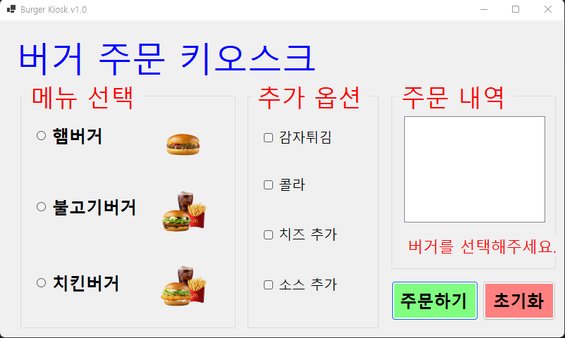
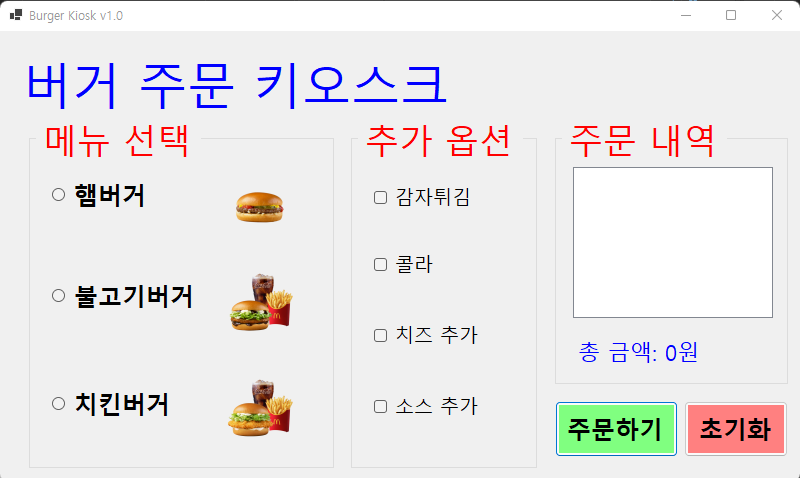
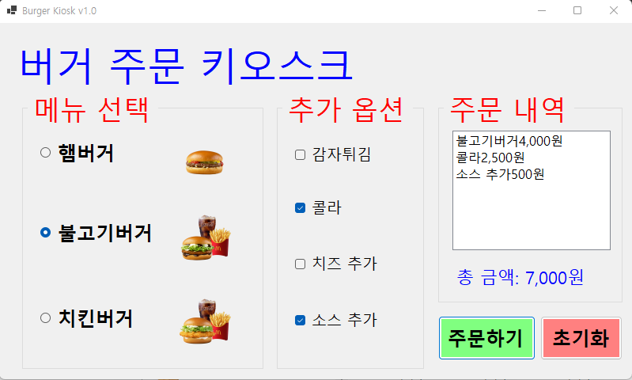

# (C# 코딩) 버거 키오스크 주문 시스템

## 개요
- C# 프로그래밍 학습
- 1줄 소개:라디오 버튼과 체크박스를 활용하여 메뉴를 선택하고 합산 금액을 확인하는 키오스크 화면
- 사용한 플랫폼:
	- C#, .NET Windows Forms, Visual Studio, GitHub
- 사용한 컨트롤:
	- Label, RadioButton, CheckBox, ListBox, Button
- 사용한 기술과 구현한 기능:
	- RadioButton과 CheckBox의 상태에 따라 메뉴 가격을 조건문으로 처리하여 실시간 합계 계산
	- 프로그램 시작 시 특정 메뉴가 자동으로 선택되지 않도록 초기화 및 포커스 제어
	- 버거 메뉴 미선택 시 MessageBox를 이용한 입력 유효성 검사 수행
	- ToString("N0") 서식을 사용하여 합계 금액에 천 단위 쉼표(,)를 표시하여 가독성 증대
	- 초기화 버튼 클릭 시 누적 금액 변수 및 UI 컨트롤들의 상태를 일괄 리셋하는 기능 구현

## 실행 화면 (과제1)
- 과제1 코드의 실행 스크린샷

- 과제 내용
	- WinForms의 주요 컨트롤인 RadioButton, CheckBox, ListBox 등을 활용하여 키오스크 주문 화면 UI를 구성하였습니다.
	- GroupBox를 사용하여 버거 메뉴와 추가 옵션 영역을 논리적으로 구분하여 배치하였습니다.
	- 주문 버튼 클릭 시 선택된 항목들을 추출하여 리스트업하고, 합산된 총 금액을 사용자에게 시각적으로 전달하는 로직을 작성하였습니다.

- 구현 내용과 기능 설명
	- RadioButton과 CheckBox의 Checked 속성을 활용하여 사용자의 메뉴 선택 상태를 파악하고, 각 항목에 할당된 가격을 조건문으로 합산하도록 구현하였습니다.
	- 결제 금액 출력 시 ToString("N0") 서식 지정자를 사용하여 천 단위 쉼표를 포함함으로써 실제 키오스크와 유사한 가독성을 제공하였습니다.
	- 초기화 버튼 클릭 시 모든 선택 상태를 해제(false)하고, 누적 금액 변수 및 ListBox의 아이템을 일괄 삭제하여 재주문이 가능한 상태로 만드는 로직을 구현하였습니다.
	- 유효성 검사를 통해 필수 항목인 버거 메뉴가 선택되지 않았을 경우 MessageBox를 호출하여 사용자에게 알림을 주는 예외 처리 기능을 적용하였습니다.

## 실행 화면 (과제2)
- 과제2 코드의 실행 스크린샷

- 과제 내용
	- 사용자가 메인 메뉴를 선택하지 않고 주문 버튼을 눌렀을 때, 프로그램의 중단 없이 오류 상황을 인지할 수 있도록 UI를 개선하였습니다.
	- 기존의 차단형 팝업 방식에서 벗어나, 폼 내부에 배치된 Label을 통해 자연스러운 에러 메시지 출력을 구현하였습니다.

- 구현 내용과 기능 설명
	- 총금액 라벨이 오류시에 빨간글씨로 오류메세지 출력하도록 설정하여, 사용자에게 명확한 시각적 피드백을 제공하였습니다.
	- 메뉴가 정상적으로 선택되어 주문이 진행될 경우에는 에러 레이블의 텍스트를 초기화하거나 숨김 처리하여 이전의 경고 문구가 남지 않도록 로직을 정교화하였습니다.
	- 이 방식을 통해 사용자의 흐름을 끊지 않으면서도 명확한 가이드라인을 제시하는 사용자 친화적 에러 처리 방식을 학습하였습니다.

## 실행 화면 (과제3)
- 과제3 코드의 실행 스크린샷

- 과제 내용
	- 마우스 조작 없이 키보드만으로 모든 주문 과정을 완료할 수 있도록 접근성을 대폭 개선하였습니다.
	- 컨트롤 간의 논리적인 이동 순서를 재정립하고 윈도우 표준 단축키 및 포커스 제어 기술을 적용하였습니다.

- 구현 내용과 기능 설명
	- 그룹박스와 내부 컨트롤 간의 탭 인덱스를 논리적 순서로 배치하여 탭 키 입력 시 메뉴와 옵션을 거쳐 주문 버튼까지 끊김 없이 순환하도록 구현하였습니다.
	- 각 그룹 내 첫 번째 항목에만 탭 정지 기능을 설정하고 나머지는 방향키로 선택하도록 구성하여 키보드 조작의 효율성을 높였습니다.
	- 폼의 수락 버튼 속성에 주문 버튼을 연동하여 어느 위치에서든 엔터 키를 누르면 즉시 주문이 처리되도록 사용자 편의 기능을 추가하였습니다.
	- 제목 레이블처럼 입력이 불필요한 요소의 탭 정지 기능을 제거하여 실제 조작이 필요한 항목에만 포커스가 머물도록 최적화하였습니다.

## 실행 화면 (과제4)
- 과제4 코드의 실행 스크린샷

- 과제 내용
	- 사용자가 항목을 선택하거나 해제할 때마다 별도의 버튼 클릭 없이 주문 내역과 결제 금액이 즉시 반영되도록 구현하였습니다.
	- 이벤트 기반 프로그래밍을 활용하여 사용자 경험의 연속성을 높이고 실시간 피드백을 제공합니다.

- 구현 내용과 기능 설명
	- 모든 라디오 버튼과 체크박스의 CheckedChanged 이벤트를 하나의 업데이트 메서드에 연결하여 상태 변화를 즉각 감지하도록 설계하였습니다.
	- 항목 상태가 변경될 때마다 리스트박스를 초기화하고 현재 선택된 모든 항목을 처음부터 다시 계산하여 내역이 중복으로 쌓이는 문제를 해결하였습니다.
	- 금액 합산 로직이 실행될 때마다 하단 금액 표시 라벨의 텍스트가 실시간으로 변경되어 사용자가 주문 현황을 즉각 파악할 수 있게 하였습니다.
	- 중복되는 계산 코드를 별도의 메서드로 분리하여 유지보수성을 높였으며, 초기화 버튼 클릭 시에도 동일한 갱신 로직이 자연스럽게 작동하도록 구현하였습니다.