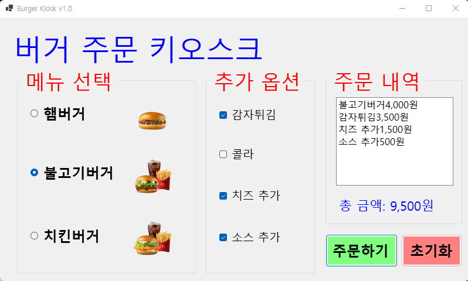

# (C# 코딩) 버거 키오스크 주문 시스템

## 개요
- C# 프로그래밍 학습
- 1줄 소개:라디오 버튼과 체크박스를 활용하여 메뉴를 선택하고 합산 금액을 확인하는 키오스크 화면
- 사용한 플랫폼:
	- C#, .NET Windows Forms, Visual Studio, GitHub
- 사용한 컨트롤:
	- Label, RadioButton, CheckBox, ListBox, Button
- 사용한 기술과 구현한 기능:
	- RadioButton과 CheckBox의 상태에 따라 메뉴 가격을 조건문으로 처리하여 실시간 합계 계산
	- 프로그램 시작 시 특정 메뉴가 자동으로 선택되지 않도록 초기화 및 포커스 제어
	- 버거 메뉴 미선택 시 MessageBox를 이용한 입력 유효성 검사 수행
	- ToString("N0") 서식을 사용하여 합계 금액에 천 단위 쉼표(,)를 표시하여 가독성 증대
	- 초기화 버튼 클릭 시 누적 금액 변수 및 UI 컨트롤들의 상태를 일괄 리셋하는 기능 구현

## 실행 화면 (과제1)
- 과제1 코드의 실행 스크린샷

- 과제 내용
	- WinForms의 주요 컨트롤인 RadioButton, CheckBox, ListBox 등을 활용하여 키오스크 주문 화면 UI를 구성하였습니다.
	- GroupBox를 사용하여 버거 메뉴(단일 선택)와 추가 옵션(다중 선택) 영역을 논리적으로 구분하여 배치하였습니다.
	- 주문 버튼 클릭 시 선택된 항목들을 추출하여 리스트업하고, 합산된 총 금액을 사용자에게 시각적으로 전달하는 로직을 작성하였습니다.

- 구현 내용과 기능 설명
	- RadioButton과 CheckBox의 Checked 속성을 활용하여 사용자의 메뉴 선택 상태를 파악하고, 각 항목에 할당된 가격을 조건문(if-else)으로 합산하도록 구현하였습니다.
	- 결제 금액 출력 시 ToString("N0") 서식 지정자를 사용하여 천 단위 쉼표(,)를 포함함으로써 실제 키오스크와 유사한 가독성을 제공하였습니다.
	- 초기화 버튼 클릭 시 모든 선택 상태를 해제(false)하고, 누적 금액 변수 및 ListBox의 아이템을 일괄 삭제하여 재주문이 가능한 상태로 만드는 로직을 구현하였습니다.
	- 유효성 검사를 통해 필수 항목인 버거 메뉴가 선택되지 않았을 경우 MessageBox를 호출하여 사용자에게 알림을 주는 예외 처리 기능을 적용하였습니다.